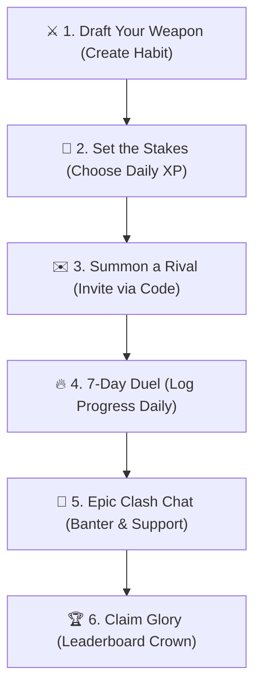

# ⚔️ HabitArena — The Ultimate Multiplayer Habit-Tracking Battlefield!

> *Challenge Friends. Forge Heroic Streaks. Conquer Procrastination Together.*

---

Setting goals is easy in your head. But what happens when you’re standing in the Arena, facing your rival, and your daily streak is on the line? 

Welcome to **HabitArena**—the world’s most immersive, premium, and competitive gamified habit tracker. Stop setting boring, lonely resolutions. HabitArena transforms your daily routine into high-stakes, multiplayer clashes. Challenge your friends, log your daily progress, earn legendary Experience Points (XP), and claim your crown on the Global Leaderboard!

---

## 🕹️ The Core Gameplay Loop

Building life-changing habits has never been this thrilling. Here is your step-by-step combat guide:

1. **Draft Your Weapon (Habit)**: Select any atomic habit you want to master (e.g., *Gym Workout, Relentless Coding, Early Rising, Study Sessions*).
2. **Set the Stakes (XP)**: Determine how much Experience Points (XP) are earned on check-in and specify your clash rules.
3. **Summon a Rival (Invite Code)**: Generate a unique alphanumeric Invite Code inside the app and summon a friend to duel.
4. **The 7-Day Duel (Daily Log)**: Log your progress daily to keep your streaks blazing hot. Watch your avatar slide across the progress bar compared to your rival!
5. **Real-time Banter**: Connect inside secure, ephemeral chat rooms to exchange updates, share proof, and talk your way to victory.
6. **Claim Glory (Leaderboard)**: Every checked-off task accumulates verified XP, boosting your rank in the global Hall of Fame.

---

## 📱 Visual Screen-by-Screen Game Guide

This section is your visual playbook. You can save your screenshots under the designated filenames inside your `images/` directory at the root of the project to see them appear live in this guide!

---

### 1. 🏁 Onboarding Screen (The Proving Grounds)
> *"Where discipline meets multiplayer warfare! Evolve from a novice to an arena overlord."*

#### 📸 GAME SCREEN CAPTURE
*Save your onboarding screenshot as `onboarding.png` inside the `images/` directory to embed it here:*

#### 🎮 Player Action Guide
* **Swipe to Explore**: Swipe left or right through the spectacular cosmic feature slides to explore the combat guidelines.
* **Initiate Registration**: Tap **GET STARTED** to create your custom warrior profile, or tap **I ALREADY HAVE AN ACCOUNT** to jump straight back into active battle zones.

---

### 2. 🏠 Main Habit Dashboard (Your Command Center)
> *"Your tactical command center. Track your clashes, protect your streaks, and log progress instantly!"*

#### 📸 GAME SCREEN CAPTURE
*Save your home dashboard screenshot as `home_dashboard.png` inside the `images/` directory to embed it here:*

#### 🎮 Player Action Guide
* **Instant Check-In**: Tap the check-in button next to any active Arena habit to register your completion.
* **Protect Your Streaks**: Monitor your glowing flame icons to make sure your streaks remain active and burning hot.
* **Summon Custom Arenas**: Tap the floating action button (+) to quickly create or join a duel using unique invite codes.

---

### 3. ➕ Arena Creator & Join Clash Panel
> *"Draft your battle terms, generate secure codes, and summon your rivals!"*

#### 📸 GAME SCREEN CAPTURE
*Save your create/join screenshot as `create_arena.png` inside the `images/` directory to embed it here:*

#### 🎮 Player Action Guide
* **Draft the Arena**: Enter your custom habit title, choose the duration, and set the daily XP stakes.
* **Generate Invites**: Tap Create. The app immediately generates a unique, shareable invite code.
* **Join Clashes**: Paste any code sent by a friend to instantly unlock their battle room and start the duel.

---

### 4. 🏟️ Arena Battle Room & Ephemeral Chat
> *"Enter the proving grounds! Chat, taunt, log, and watch your progress bars collide in real-time."*

#### 📸 GAME SCREEN CAPTURE
*Save your battle room screenshot as `battle_room.png` inside the `images/` directory to embed it here:*

#### 🎮 Player Action Guide
* **Watch Progress Bars Collide**: Track real-time progress bars as you and your rival check in daily.
* **Opponent Status Radar**: The live header indicator informs you instantly if your opponent is online, typing, or currently active in the chat!
* **Banter & Proof Chat**: Engage in fast-paced real-time chat. Coordinate your duels, share success tips, or playfully taunt your rivals!

---

### 5. 🏆 Global Leaderboard (The Pantheon of Grit)
> *"Claim your spot among the legendary elite. Evolve your score and secure eternal glory!"*

#### 📸 GAME SCREEN CAPTURE
*Save your leaderboard screenshot as `leaderboard.png` inside the `images/` directory to embed it here:*

#### 🎮 Player Action Guide
* **Compare Ranks**: Track your ranking on the Global Leaderboard calculated directly from your total verified accumulated XP.
* **Inspect Rivals**: View rival player stats, total battles fought, active streaks, and profile details.
* **XP Dominance**: Consistently complete habit targets inside your Arenas to gain maximum XP and ascend to the top!

---

### 6. ⚙️ Settings & Sleek "About App" Info Panel
> *"Manage profile assets, adjust notification rules, and discover our premium developer heritage!"*

#### 📸 GAME SCREEN CAPTURE
*Save your settings/about screenshot as `about_app.png` inside the `images/` directory to embed it here:*

#### 🎮 Player Action Guide
* **Personalize Profile**: Easily edit your display name, upload custom avatars, and adjust notifications.
* **Explore App History**: Tap **About App** inside the Account menu to discover:
  * **App Purpose**: *A high-performance, gamified habit tracker designed to boost productivity, defeat procrastination, and build unbreakable daily streaks with peers.*
  * **Developer**: Ahmad Abdullah Chaudary (Chaudary Global).
  * **Version Info**: v1.0.0.
  * **Official Tagline**: *"Forged with passion and ❤️ to unlock your ultimate potential."*
* **Complete Data Sovereignty**: Under GDPR/CCPA guidelines, tap **Delete Account** in the danger zone to permanently delete your data records from all database pipelines.

---

## ⚡ Premium Player-Resilience Technology

Under its sleek, glassmorphic visual styles, HabitArena houses state-of-the-art gaming engines to ensure a flawless experience:

* **⚡ Instant Strike (Optimistic UI & Haptics)**: Checking in is incredibly snappy! Tap check-in, and the app immediately thuds haptics and updates progress locally in 0ms, managing all sync procedures safely in the background.
* **📡 Offline Combat Ready (Local Caching)**: Out of service in the gym or subway? No problem! Log your progress offline. The app securely caches all check-ins locally using **TTL-based SharedPreferences storage** and syncs them automatically when connection returns.
* **📡 Live Radar (WebSocket Presence)**: Real-time opponent presence tracking uses memory-based WebSocket streams. It broadcasts active, online, or typing indicators between players in under 15ms without server-side lag!
* **🛡️ Anti-Cheat Shield (Secure RPC Transactions)**: Game scores and database updates run through secure database remote procedures (RPCs). Users cannot hack, cheat, or inject false XP metrics, ensuring complete fair play.
